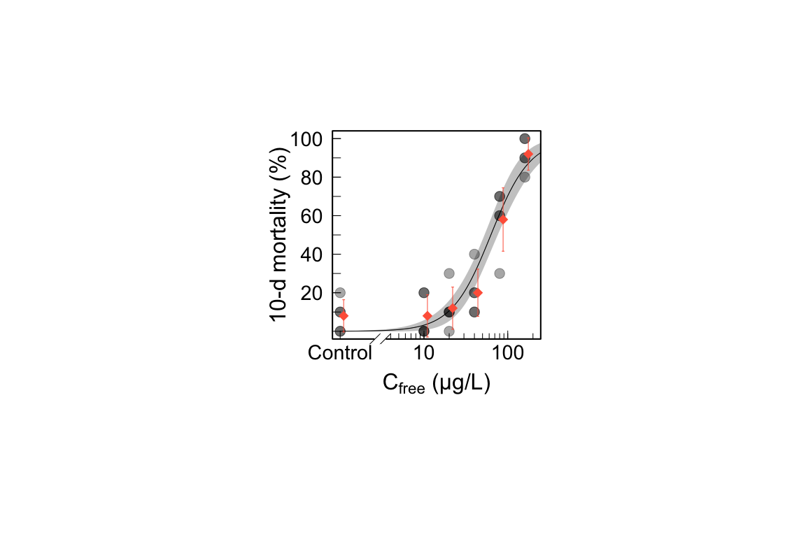

Kyoshiro HIKI
2020.05.12

致死率を指標とした容量応答関係の図示の一例を示す
------------------------------------------------

生存率データの入力
------------------

``` r
require(tidyverse)

# An example dataset　適当
surv <- read.table(textConnection("
0   1   2 8 10
0   2   1 9 10
0   3   0 10 10
0   4   1 9 10
0   5   0 10 10
10  1   0 10 10
10  2   0 10 10
10  3   2 8 10
10  4   2 8 10
10  5   0 10 10
20  1   1 9 10
20  2   1 9 10
20  3   0 10 10
20  4   1 9 10
20  5   3 7 10
40 1    4 6 10
40  2   1 9 10
40  3   2 8 10
40  4   2 8 10
40  5   1 9 10
80 1    7 3 10
80  2   6 4 10
80  3   7 3 10
80  4   3 7 10
80  5   6 4 10
160 1   10 0 10
160 2   9 1 10
160 3   9 1 10
160 4   8 2 10
160 5   10 0 10
"))
names(surv) <- c("Concentration", "Beaker","Dead","Survival","Total")

# 基本統計量の計算
stat_surv <- surv %>%
  group_by(Concentration) %>%
  dplyr::summarise(Mean = round(mean(Dead/Total),2),SD=round(sd(Dead/Total),2)) 
```

</br> </br>

生存率データの作図
------------------

``` r
require(drc)
require(plotrix)

# 2 parameter log-logistic model assuming binomial distribution
model <- drm(Dead/Total ~ Concentration, data=surv, type="binomial", weights=Total, fct = LL.2() )
ED(model, c(50), interval="delta")  # LC50 estimation
```

    ## 
    ## Estimated effective doses
    ## 
    ##        Estimate Std. Error   Lower   Upper
    ## e:1:50  62.8688     5.7882 51.5242 74.2134

``` r
# plot
par(mar=c(6,6,1,1), mgp=c(3.3, 0.7, 0),fin = c(4.5,4.5))
plot(model, type="all", ylab="10-d mortality (%)",  xlab=expression(paste(C[free]," (μg/L)")), cex=2, broken=FALSE, conName="Control",  cex.lab=2.0, tcl=0.5, axes=FALSE, ylim=c(0,1),xlim=c(0,200) ,log="x", col=rgb(0, 0, 0, 0.35),pch=19)
plot(model, type="conf", ylab="", xlab="", cex=2, broken=FALSE, conName="Control", add=TRUE, cex.lab=2.0, tcl=0.5, axes=FALSE, ylim=c(0,1),xlim=c(0,1000),log="x")
box(lwd=2)
axis(side=1, c(seq(3,9,1)), labels=FALSE, tcl=0.4)  
axis(side=1, c(seq(10,90,10)), labels=FALSE, tcl=0.4)  
axis(side=1, c(seq(100,900,100)), labels=FALSE, tcl=0.4)
axis(side=1, c(1,10,100), labels=c("Control","10","100") , tcl=0.6, cex.axis=1.8)  
axis(side=2, c(seq(0.2,1,0.2)), labels=c("20","40","60","80","100"), tcl=0.6, las=TRUE, cex.axis=1.8)  
axis(side=2, c(seq(0,1,0.1)), labels=FALSE, tcl=0.6) 
axis.break(axis=1,3, style="slash",brw=0.05)

# Add mean and SD
# Similar vizualization can be done also by stat_summary in ggplot2
# より洗練された作図はggplot2で実施してくだされ
surv2 <- surv #just for visualization
surv2[surv2[,"Concentration"]==0,"Concentration"]<- rep(1,5)

par (new=TRUE)
plot( aggregate(surv2$Dead/10, list( surv2$Concentration*1.1 ), mean),col="tomato",cex=2,log="x",pch=18 , axes=FALSE, ylim=c(0,1),xlim=c(1,200),xlab="",ylab="")
arrows(aggregate(surv2$Dead/10, list( surv2$Concentration*1.1 ), mean)[,1],  (aggregate(surv2$Dead/10, list( surv2$Concentration*1.1 ), mean)+aggregate(surv2$Dead/10, list( surv2$Concentration*1.1 ), sd))[,2],  aggregate(surv2$Dead/10, list( surv2$Concentration*1.1 ), mean)[,1],  (aggregate(surv2$Dead/10, list( surv2$Concentration*1.1 ), mean)-aggregate(surv2$Dead/10, list( surv2$Concentration*1.1), sd))[,2], length=0.02, angle=90, code=3, col="tomato") 
```



``` r
#text(locator(1), labels = "**",cex=2) # if necessary
```

Controlとの致死率の有意差について仮説検定
=========================================

``` r
# LC50 estimation
require(multcomp)

# Dunnett's検定によりControlとの比較
surv$Concentration <- as.factor(surv$Concentration)
fit <- glm(formula=cbind (Total-Dead, Dead) ~ Concentration, data=surv, family=binomial (link="logit"))
summary (glht (fit, linfct=mcp (Concentration="Dunnett"), alternative="less"))   # alternative="less"はone-sided の検定
```

    ## 
    ##   Simultaneous Tests for General Linear Hypotheses
    ## 
    ## Multiple Comparisons of Means: Dunnett Contrasts
    ## 
    ## 
    ## Fit: glm(formula = cbind(Total - Dead, Dead) ~ Concentration, family = binomial(link = "logit"), 
    ##     data = surv)
    ## 
    ## Linear Hypotheses:
    ##                Estimate Std. Error z value Pr(<z)    
    ## 10 - 0 >= 0  -1.729e-14  7.372e-01   0.000  0.797    
    ## 20 - 0 >= 0  -4.499e-01  6.791e-01  -0.663  0.529    
    ## 40 - 0 >= 0  -1.056e+00  6.299e-01  -1.677  0.142    
    ## 80 - 0 >= 0  -2.765e+00  5.948e-01  -4.648 <0.001 ***
    ## 160 - 0 >= 0 -4.885e+00  7.372e-01  -6.626 <0.001 ***
    ## ---
    ## Signif. codes:  0 '***' 0.001 '**' 0.01 '*' 0.05 '.' 0.1 ' ' 1
    ## (Adjusted p values reported -- single-step method)

``` r
# 80, 160μg/Lで有意差（p < 0.001）あり
```
