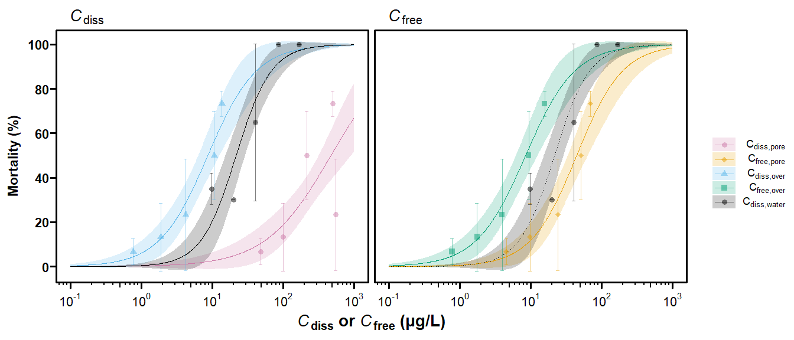

## ライブラリの読み込み

    require(ggplot2)
    require(ggprism)
    require(cowplot)
    require(ggpubr)
    require(ggExtra)
    require(gridExtra)
    require(grid)
    require(tidyverse)
    require(openxlsx)
    require(EnvStats)
    require(ggpubr)
    require(lemon)
    require(drc)
    require(plotrix)
    require(scales)

 ## データの読み込み
    data_surv <-  read.xlsx("2021.09.08_sed_data_forR.xlsx",sheet="Survival") %>%
      filter(Day==10)
    data_doc <- read.xlsx("2021.09.08_sed_data_forR.xlsx",sheet="DOC")
    data_cfree <- read.xlsx("2021.09.08_sed_data_forR.xlsx",sheet="Cfree") %>% 
      filter(Day <=10) %>%
      group_by (Nominal,Type) %>%
      summarize(Cfree=mean(Cfree,na.rm=TRUE)) %>%
      mutate(Cfree = ifelse(is.nan(Cfree),NA,Cfree))

    ## `summarise()` has grouped output by 'Nominal'. You can override using the `.groups` argument.

    data_cdiss <- read.xlsx("2021.09.08_sed_data_forR.xlsx",sheet="Cdissolved") %>%
      filter(Day <=10) %>%
      group_by (Nominal,Type) %>%
      summarize(Cdiss=mean(Cdissolved,na.rm=TRUE)) %>%
      mutate(Cdiss = ifelse(is.nan(Cdiss),NA,Cdiss))

    ## `summarise()` has grouped output by 'Nominal'. You can override using the `.groups` argument.

    # water-only tests (96-h)
    data_water_only <- read.xlsx("2021.09.08_sed_data_forR.xlsx",sheet="Water-only") %>%
      dplyr::rename(Cdiss=Cdissolved)

    #### Sediment testの生存データは一つのdata.frameに統合
    # 濃度データは各濃度区の平均値を使用
    Flu_sed <- merge (data_surv, data_cfree,all=TRUE) %>% 
      pivot_wider (names_from=Type,values_from=Cfree,names_prefix="Cfree_") %>%  
      merge(data_cdiss , all=TRUE) %>% 
      pivot_wider (names_from=Type,values_from=Cdiss,names_prefix="Cdiss_") 

  ## モデル推定
    # mean_surv_ctrl <- CPS_sed %>% filter(Nominal==0) %>% summarise(mean=mean(Survival/Total))

    model_sed_cfree_pore <- drm(Dead/Total~Cfree_Pore, data=Flu_sed, type="binomial", weights=Total, fct = LL.2() )
    model_sed_cfree_over <- drm(Dead/Total~Cfree_Overlying, data=Flu_sed, type="binomial", weights=Total, fct = LL.2() )
    model_sed_cdiss_pore <- drm(Dead/Total~Cdiss_Pore, data=Flu_sed, type="binomial", weights=Total, fct = LL.2() )
    model_sed_cdiss_over <- drm(Dead/Total~Cdiss_Overlying, data=Flu_sed, type="binomial", weights=Total, fct = LL.2() )
    model_sed_cdiss_water <- drm(Dead/Total~Cdiss, data=data_water_only, type="binomial", weights=Total, fct = LL.2() )

    ## preparation for figure: regression curve
    Conc <- expand.grid(Conc=exp(seq(log(10^(-1)), log(10^3), length=1000))) 

    Pred_Cdiss_pore <- predict(model_sed_cdiss_pore, newdata=Conc, interval="confidence") %>%
      cbind(Conc) %>% cbind(label="Cdiss,pore",Type=c("italic(C)[diss]"))
    Pred_Cdiss_over <- predict(model_sed_cdiss_over, newdata=Conc, interval="confidence") %>%
      cbind(Conc) %>% cbind(label="Cdiss,over",Type=c("italic(C)[diss]"))
    Pred_Cfree_pore <- predict(model_sed_cfree_pore, newdata=Conc, interval="confidence") %>%
      cbind(Conc) %>% cbind(label="Cfree,pore",Type=c("italic(C)[free]"))
    Pred_Cfree_over <- predict(model_sed_cfree_over, newdata=Conc, interval="confidence") %>%
      cbind(Conc) %>% cbind(label="Cfree,over",Type=c("italic(C)[free]"))
    Pred_Cdiss_water <- predict(model_sed_cdiss_water, newdata=Conc, interval="confidence") %>%
      cbind(Conc) %>% cbind(label="Cdiss,water",Type=c("italic(C)[diss]"))
    Pred_Cdiss_water2 <- predict(model_sed_cdiss_water, newdata=Conc, interval="confidence") %>%    ### just for figure
      cbind(Conc) %>% cbind(label="Cdiss,water",Type=c("italic(C)[free]"))

    Fits <- Pred_Cdiss_pore %>% bind_rows(Pred_Cdiss_over,Pred_Cfree_pore, Pred_Cfree_over, Pred_Cdiss_water,Pred_Cdiss_water2) 

    ## preparation for figure: mean mortality at each concentration
    Mean_Cdiss_pore <- model_sed_cdiss_pore$data %>% dplyr::select(Cdiss_Pore,"Dead/Total") %>%
      rename(Conc=Cdiss_Pore,Mortality="Dead/Total") %>%
    #  filter(Conc != 0) %>%
      mutate(label="Cdiss,pore",Type=c("italic(C)[diss]") )
    Mean_Cdiss_over <- model_sed_cdiss_over$data %>% dplyr::select(Cdiss_Overlying,"Dead/Total") %>%
      rename(Conc=Cdiss_Overlying,Mortality="Dead/Total") %>%
      filter(Conc != 0) %>%
      mutate(label="Cdiss,over",Type=c("italic(C)[diss]") )
    Mean_Cfree_pore <- model_sed_cfree_pore$data %>% dplyr::select(Cfree_Pore,"Dead/Total") %>%
      rename(Conc=Cfree_Pore,Mortality="Dead/Total") %>%
      filter(Conc != 0) %>%
      mutate(label="Cfree,pore",Type=c("italic(C)[free]") )
    Mean_Cfree_over <- model_sed_cfree_over$data %>% dplyr::select(Cfree_Overlying,"Dead/Total") %>%
      rename(Conc=Cfree_Overlying,Mortality="Dead/Total") %>%
      filter(Conc != 0) %>%
      mutate(label="Cfree,over",Type=c("italic(C)[free]") )
    Mean_Cdiss_water <- model_sed_cdiss_water$data %>% dplyr::select(Cdiss,"Dead/Total") %>%
      rename(Conc=Cdiss,Mortality="Dead/Total") %>%
      filter(Conc != 0) %>%
      mutate(label="Cdiss,water",Type=c("italic(C)[diss]") )
    Mean_Cdiss_water2 <- model_sed_cdiss_water$data %>% dplyr::select(Cdiss,"Dead/Total") %>%
      rename(Conc=Cdiss,Mortality="Dead/Total") %>%
      filter(Conc != 0) %>%
      mutate(label="Cdiss,water",Type=c("italic(C)[free]") )

    Mean_mortality <- Mean_Cdiss_pore  %>% bind_rows(Mean_Cdiss_over,Mean_Cfree_pore,Mean_Cfree_over,Mean_Cdiss_water,Mean_Cdiss_water2)  %>% mutate(label=fct_relevel(label,"Cdiss,pore","Cfree,pore","Cdiss,over","Cfree,over","Cdiss,water")) 

    ## Plot
    Figure_flu <- Fits %>%
      mutate(label= fct_relevel(label,"Cdiss,pore","Cfree,pore","Cdiss,over","Cfree,over","Cdiss,water"))%>%
      mutate(lty = ifelse(Type=="italic(C)[free]" & label=="Cdiss,water", "dotted","solid")) %>%
      ggplot() +
      facet_wrap(~Type,strip.position="top",labeller = label_parsed)+
      geom_ribbon(aes(x=Conc, y=Prediction, ymin=Lower, ymax=Upper,fill=label), alpha=0.2) +
      geom_line(aes(x=Conc, y=Prediction,col=label,linetype=lty)) +
      stat_summary(data=Mean_mortality,
                   aes(x=Conc,y=Mortality,col=label),fun = mean,
                   fun.min = function(x) mean(x) - sd(x), 
                   fun.max = function(x) mean(x) + sd(x), 
                   geom = "errorbar",size=0.5,width=0.05, alpha=0.5)+
      stat_summary(data=Mean_mortality,
                   aes(x=Conc,y=Mortality,col=label,shape=label),fun = mean,
                   geom = "point",size=3, alpha=0.5)+
      scale_y_continuous(breaks=seq(0,1,0.2), labels=c("0","20","40","60","80","100")) +
      scale_x_continuous(trans=log10_trans(),breaks=10^(-1:3),
                         labels=trans_format("log10",math_format(10^.x))) +
      annotation_logticks( outside=TRUE,size=1,side="b" )+
      coord_cartesian(clip = "off")+
      theme_prism(base_size=17,border = TRUE )+
      theme(panel.grid.minor = element_blank(),
            panel.grid.major = element_blank(),
            axis.title.x = element_text(size=21),
            strip.text = element_text(hjust = 0.05, size=21), legend.position = "none" )+
      labs(y="Mortality (%)",
           x=expression(bold(paste(italic(C)[diss]," or ",italic(C)[free]," (μg/L)"))))+
      scale_fill_manual("metrics",values=c("#CC79A7", "#E69F00", "#56B4E9", "#009E73","black"),
                                     labels = c(expression(C[paste(diss,",",pore)]),
                                                expression(C[paste(free,",",pore)]),
                                                expression(C[paste(diss,",",over)]),
                                                expression(C[paste(free,",",over)]),
                                                expression(C[paste(diss,",",water)])  ))+ 
      scale_color_manual("metrics",values=c("#CC79A7", "#E69F00", "#56B4E9", "#009E73","black"),
                                     labels = c(expression(C[paste(diss,",",pore)]),
                                                expression(C[paste(free,",",pore)]),
                                                expression(C[paste(diss,",",over)]),
                                                expression(C[paste(free,",",over)]),
                                                expression(C[paste(diss,",",water)])))+
      scale_shape_manual("metrics",
                          values=c(16,18,17,15,16),
                          labels = c(expression(C[paste(diss,",",pore)]),
                                                expression(C[paste(free,",",pore)]),
                                                expression(C[paste(diss,",",over)]),
                                                expression(C[paste(free,",",over)]),
                                                expression(C[paste(diss,",",water)])))+
      scale_linetype_manual(values=c("dotted","solid"))

    ### for legend 
    Figure_legend <- Fits %>%
      mutate(label= fct_relevel(label,"Cdiss,pore","Cfree,pore","Cdiss,over","Cfree,over","Cdiss,water"))%>%
      mutate(lty = ifelse(Type=="italic(C)[free]" & label=="Cdiss,water", "dotted","solid")) %>%
      ggplot() +
      facet_wrap(~Type,strip.position="top",labeller = label_parsed)+
      geom_ribbon(aes(x=Conc, y=Prediction, ymin=Lower, ymax=Upper,fill=label), alpha=0.2) +
      stat_summary(data=Mean_mortality,
                   aes(x=Conc,y=Mortality,col=label),fun = mean,
                   fun.min = function(x) mean(x) - sd(x), 
                   fun.max = function(x) mean(x) + sd(x), 
                   geom = "errorbar",size=0.5,width=0.05, alpha=0.5)+
      stat_summary(data=Mean_mortality,
                   aes(x=Conc,y=Mortality,col=label,shape=label),fun = mean,
                   geom = "point",size=3, alpha=0.5)+
      coord_cartesian(clip = "off")+
      theme_prism(base_size=17,border = TRUE )+
      scale_fill_manual("metrics",values=c("#CC79A7", "#E69F00", "#56B4E9", "#009E73","black"),
                                     labels = c(expression(C[paste(diss,",",pore)]),
                                                expression(C[paste(free,",",pore)]),
                                                expression(C[paste(diss,",",over)]),
                                                expression(C[paste(free,",",over)]),
                                                expression(C[paste(diss,",",water)])  ))+ 
      scale_color_manual("metrics",values=c("#CC79A7", "#E69F00", "#56B4E9", "#009E73","black"),
                                     labels = c(expression(C[paste(diss,",",pore)]),
                                                expression(C[paste(free,",",pore)]),
                                                expression(C[paste(diss,",",over)]),
                                                expression(C[paste(free,",",over)]),
                                                expression(C[paste(diss,",",water)])))+
      scale_shape_manual("metrics",
                          values=c(16,18,17,15,16),
                          labels = c(expression(C[paste(diss,",",pore)]),
                                                expression(C[paste(free,",",pore)]),
                                                expression(C[paste(diss,",",over)]),
                                                expression(C[paste(free,",",over)]),
                                                expression(C[paste(diss,",",water)])))

    legend <- get_legend(
      Figure_legend + theme(legend.box.margin = margin(0, 0, 0, 14))
    )

    Figure_flu_with_legend <- plot_grid(Figure_flu,legend, ncol=2, rel_widths = c(5.5, 0.8) )

    #tiff("Figure_flu.tiff", units="in", width=14, height=6, res=320)
    Figure_flu_with_legend

    #dev.off()
